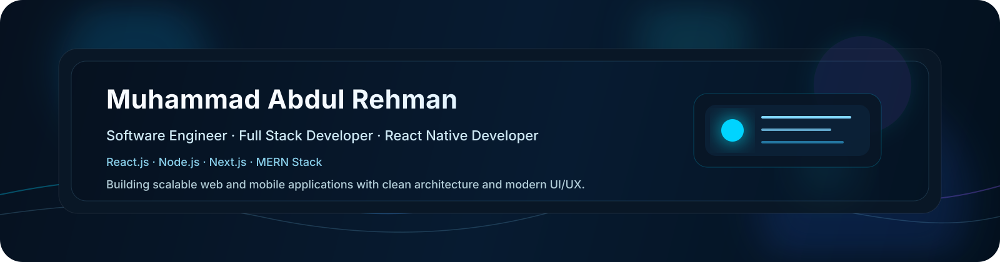

  

# Muhammad Abdul Rehman

### Software Engineer | Full Stack Developer | React.js • React Native • Node.js • Next.js

  

  
  
  
  

  
  
  

  
  
  

  

## About Me

I’m a Software Engineer and Full Stack Developer focused on building scalable web and mobile applications with modern technologies. My core experience spans React.js, React Native, the MERN stack, and backend systems powered by Node.js and REST APIs.

I care deeply about clean architecture, intuitive UI/UX, and products that are both technically strong and easy to use. I enjoy solving hard problems, integrating AI-driven features, and shaping reliable digital experiences with strong performance, maintainability, and quality.

## GitHub Insights

<table>
<tr>
<td width="50%" valign="top">

</td>
<td width="50%" valign="top">

</td>
</tr>
</table>

  

  

  

## Featured Projects

<table>
<tr>
<td width="50%" valign="top">

### 🌐 Awaam Assist
A government schemes finder with an eligibility checker and AI-assisted guidance to help users discover the right programs faster.

**Highlights:**
- Government Schemes Finder
- Eligibility Checker
- AI Integration
- Clean, accessible UX

</td>
<td width="50%" valign="top">

### 💼 Business Nexus
A modern MERN platform for real-time collaboration, authentication, and streamlined business communication.

**Highlights:**
- MERN Stack
- Real-Time Chat
- Authentication
- Scalable backend architecture

</td>
</tr>
<tr>
<td width="50%" valign="top">

### 🏗️ BuildFlow Pro
A construction workflow platform designed to improve project visibility, task coordination, and operational efficiency.

**Highlights:**
- Workflow automation
- Project tracking
- Team collaboration
- Productivity-focused design

</td>
<td width="50%" valign="top">

### 📱 Checkmate
A React Native and AI-powered mobile experience built for smart field workflows and fast on-the-go usage.

**Highlights:**
- React Native
- AI Site Inspection
- Mobile-first UX
- Performance-conscious implementation

</td>
</tr>
<tr>
<td width="50%" valign="top">

### ⚡ ElectraX
A React Native inspection app designed for structured data capture, field operations, and practical mobile workflows.

**Highlights:**
- React Native
- Inspection App
- Operational efficiency
- Smooth mobile interactions

</td>
<td width="50%" valign="top">

### 🤖 AI-Enabled Product Systems
I also build AI-enhanced features that improve decision-making, automation, and product intelligence across web and mobile systems.

**Highlights:**
- AI integration
- Smart workflows
- Product innovation
- Scalable architecture

</td>
</tr>
</table>

## Tech Stack

### Frontend

  

### Backend

  

### Mobile

  

### Cloud and DevOps

  

### Tools

  

## Currently Learning

  
  
  
  
  
  

## Social Links

  
  
  
  
  

  

## GitHub Tactics

- I build maintainable products with clean architecture, modern UI systems, and practical delivery.
- I care about performance, reliability, and smooth developer experience as much as visual polish.
- I like shipping work that is recruiter-friendly, production-ready, and easy to evaluate quickly.

## GitHub Workflow Files

Place the workflow files under `.github/workflows` in the repository root that powers your profile README:

- `.github/workflows/snake.yml` for the contribution snake animation
- `.github/workflows/update.yml` if you want an optional scheduled README refresh pipeline

## Notes

- This README uses live widgets from GitHub README Stats, Streak Stats, Activity Graph, Trophy, Profile Views Counter, Skill Icons, Shields.io, and the snake contribution generator.
- The snake workflow needs repository Actions enabled and write access to the output branch.
- For a profile README, the repository name should match your username: `AbdulRehman-Qasim`.
